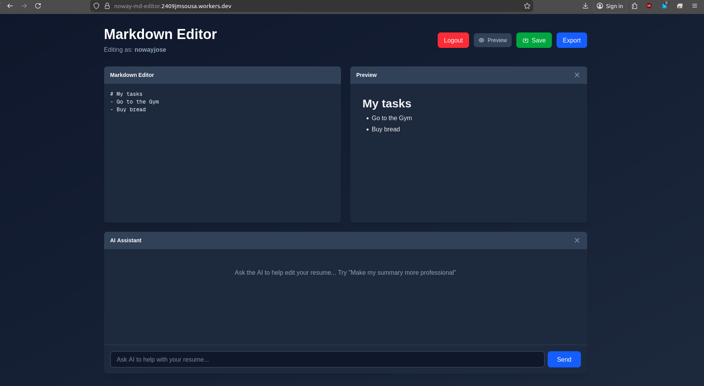

# noway-md-editor

This project is a Cloudflare-deployable Next.js app (OpenNext) that demonstrates using Cloudflare Workers + Workers KV for storing user markdown and Workers AI (Llama 3.3 on Workers AI) for LLM-powered editing assistance.

**Live app:** [https://noway-md-editor.2409jmsousa.workers.dev/](https://noway-md-editor.2409jmsousa.workers.dev/)



## Architecture
- Frontend: Next.js running on Cloudflare Worker
- API: Worker handles API requests and talks to Workers KV for storage
- AI: Worker AI provides Llama 3 for editing assistance

## Local development
Install dependencies and run locally:

```bash
npm install
npm run dev
```

Open http://localhost:3000 to try the app locally.


## Deploy (Cloudflare Workers)
Build and deploy with the provided scripts (this project uses OpenNext packaging):

```bash
npm run build
npm run deploy
```

Ensure your KV namespace is bound in the deployment config and that any server-only secrets are set in your Cloudflare worker secrets (not client env vars).

## How to try the components
- Local: run the dev server and use the UI to enter a username, edit markdown, and use the AI assistant.
- Deployed: after `npm run deploy` the deployment output will include a worker URL. Use that to open the app and exercise save/load.

## Demo
A short demo of the app is included in this repository as `vid.webm`. You can preview it directly in GitHub or download it locally.

<video controls loop muted style="max-width:100%;height:auto">
    <source src="vid.webm" type="video/webm" />
    Your browser does not support the video tag. Download the demo: [vid.webm](vid.webm)
</video>

## PROMPTS.md
See `PROMPTS.md` for the LLM prompts used.

- Cloudflare Workers: https://developers.cloudflare.com/workers/
- Workers KV: https://developers.cloudflare.com/workers/runtime-apis/kv/
- Workers AI: https://developers.cloudflare.com/workers/learning/ai
